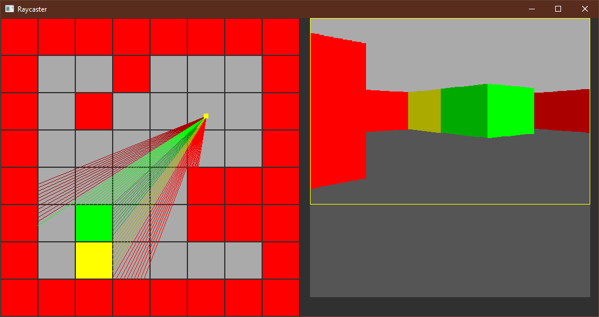

Raycaster tech testing

Uses [libsdl](https://www.libsdl.org/). 
Watching [video tutorial](https://youtu.be/gYRrGTC7GtA?si=nZjOVW72W01-kSp5).

# Building
On macOS you will need to download the libsdl framework and copy to /Library/Frameworks, alternativly, ~/Library/Frameworks.

You will also need to allow the app to run. First run the app to get the error and then going to **Apple > System Preferences > Security & Privacy** And there should be a button to allow.

